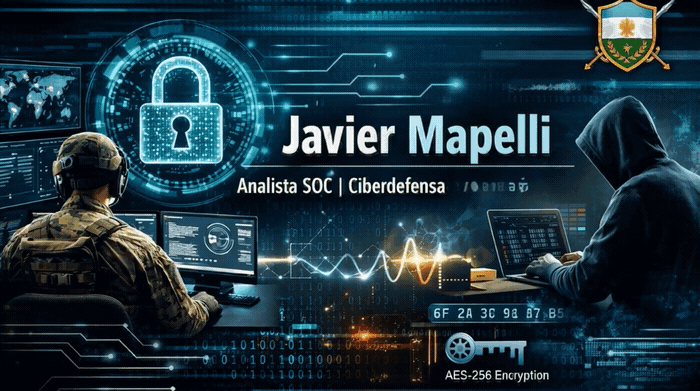

[Español](README.md) · **[English](README.en.md)**

### SOC Analyst · Argentine Army Cyberdefense
Linux · Python · Security Tooling · Applied Cryptography

---

### About me

I work as a SOC analyst at the Argentine Army's Cyberdefense Directorate: monitoring alerts, triaging incidents, and correlating events with SIEM, IDS, and case management platforms. In parallel, I keep learning Python, Linux, data analysis, and offensive/defensive security — in that order of chaos.

When I hear "AES is secure" or "that protocol is vulnerable," I need to see why. That's why I build my own labs and tools instead of stopping at theory — **verify it yourself** is the idea running through everything I do.

- 🔐 **Operational cyberdefense:** SOC, Blue Team, network protocol analysis, detection and triage
- 🔬 **Applied cryptography:** AES, ASCON, ChaCha20, hashing — down to the algorithmic internals, not just the theory
- 🛠 **Security tool development:** full-stack (TypeScript/Python) and desktop (PySide6)
- 📊 **Data analysis:** SQL, advanced Excel, Power BI, applied GenAI

### 🚀 Projects

| Project | What it does | Stack |
|---|---|---|
| [**OT-ICS_Cybersecurity_Lab**](https://github.com/xavimape/OT-ICS_Cybersecurity_Lab) | Educational OT/ICS cybersecurity lab: industrial protocols (Modbus TCP, with DNP3, OPC UA, IEC 60870-5-104, PROFINET, EtherNet/IP coming next) with interactive simulators, detection (Suricata/Sigma), and MITRE ATT&CK for ICS mapping | HTML/CSS/JS, 100% client-side, bilingual |
| [**protocolos-red-soc**](https://github.com/xavimape/protocolos-red-soc) | Interactive lab covering 9 network protocols (DNS, HTTP/HTTPS, TCP, UDP, DHCP, SMB, FTP, SSH, TLS/SSL): how they work, where they get attacked, how to detect it | HTML5 / CSS3 / JS ES6, 100% client-side |
| [**MetaView-Pro**](https://github.com/xavimape/MetaView-Pro) | EXIF/IPTC/XMP metadata inspector/editor with raster integrity verification and automatic rollback | TypeScript (Express/React), Python/PySide6 |
| [**criptografia-simetrica**](https://github.com/xavimape/criptografia-simetrica) | Lab covering AES-256-GCM, ASCON-128, ChaCha20-Poly1305, and hashing, with SOC/DFIR operational context | JavaScript, 100% client-side |
| [**clase-criptografia**](https://github.com/xavimape/clase-criptografia) | Educational material on applied cryptography for SOC: 11 modules, John The Ripper and JA3/TLS Fingerprinting labs | HTML/CSS/JS |
| [**ASCON-128a-Educational-Visualizer**](https://github.com/xavimape/ASCON-128a-Educational-Visualizer) | Step-by-step visualizer for the ASCON-128a algorithm (CAESAR competition winner), with a Tkinter GUI | Python |

All open source (MIT). More detail on each one in my [portfolio](https://xavimape.github.io/xavimape-porfolio/proyectos).

### 🧠 How I work

Research → Document → Build → Teach → Improve

20+ years of operational leadership in high-demand environments (Argentine Army, United Nations mission) applied today to procedural discipline, incident management, and clear technical documentation — in Spanish and English.

---

*"Verify it yourself."*

